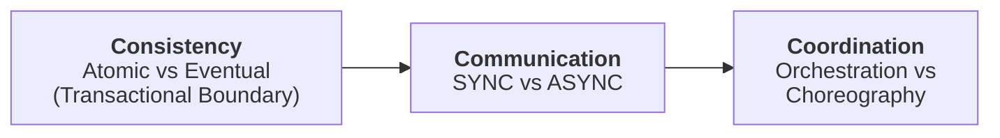

# Distributed Systems

- [Fallacies of distributed computing](https://en.wikipedia.org/wiki/Fallacies_of_distributed_computing)

Workflow in microservices that might need transactionality.  

Primal Forces

- Consistency : Atomic vs Eventual
- Communication : Sync vs Async
- Coordination - Orchestration or Choreography



## Example Problem - Sysops Squad

::: details Example : Product plus service plan, Service has tickets created. {open}

- customer submits a ticket to `ticket-management-service`.  
- Experts driving with sysops system on mobile -> constraints are relevant skills, location, and availability
basically famous travelling salesperson problem.  
- Notify expert -> accepted by them -> notify user of assigned expert -> experts travels and start work -> marks complete -> experts status update -> customer survey
:::

```
Transactional Sagas
workflow: Expert marks ticket -> complete ticket -> update expert status -> send survey
- Communication - Sync vs Async
- Coordination - Orchestration or Choreography
- Transactional Boundary - Atomic vs Eventual Consistency
```

## ACID vs BASE Transactions

ACID for Relational Databases

